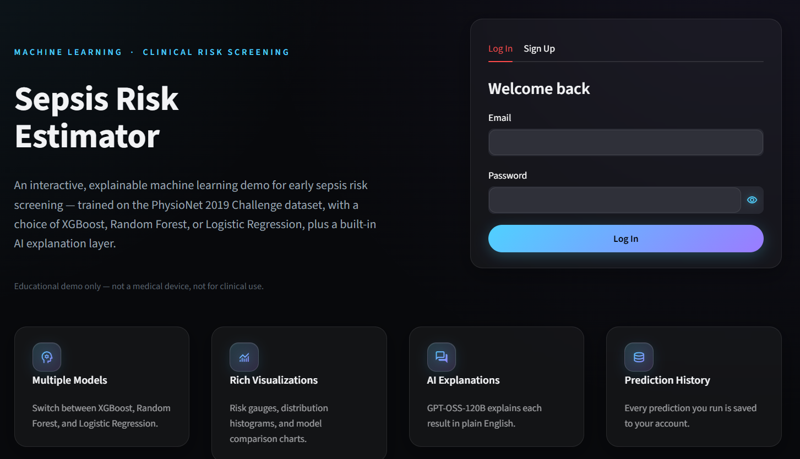
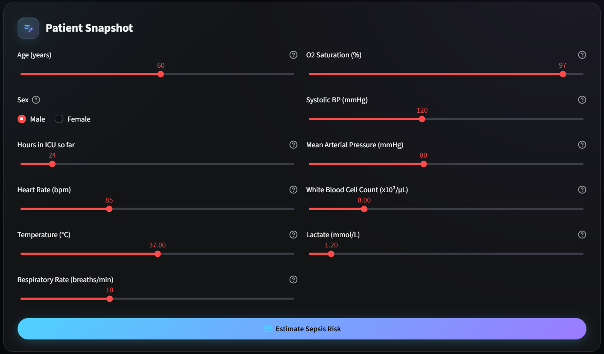
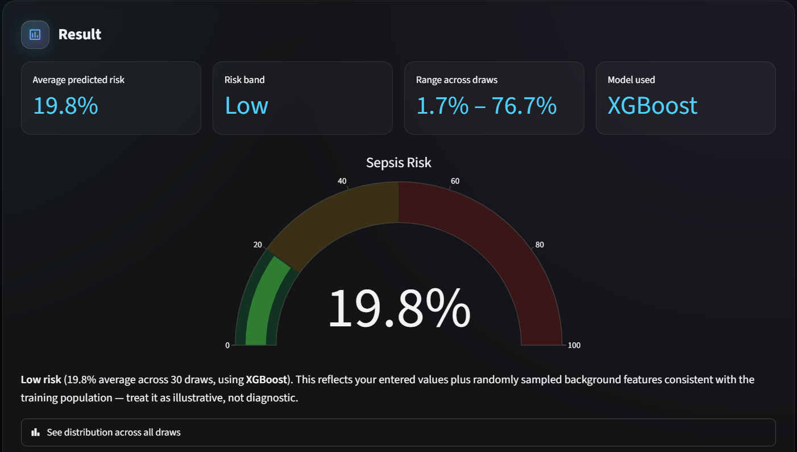
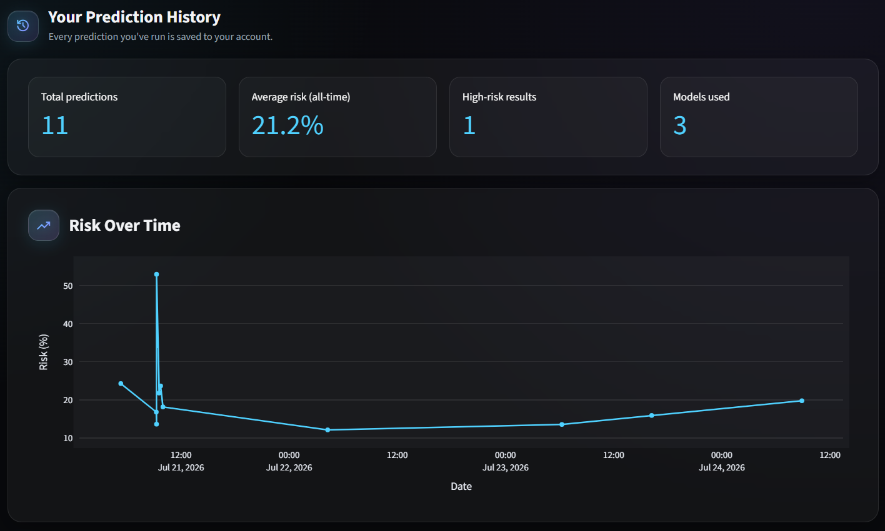
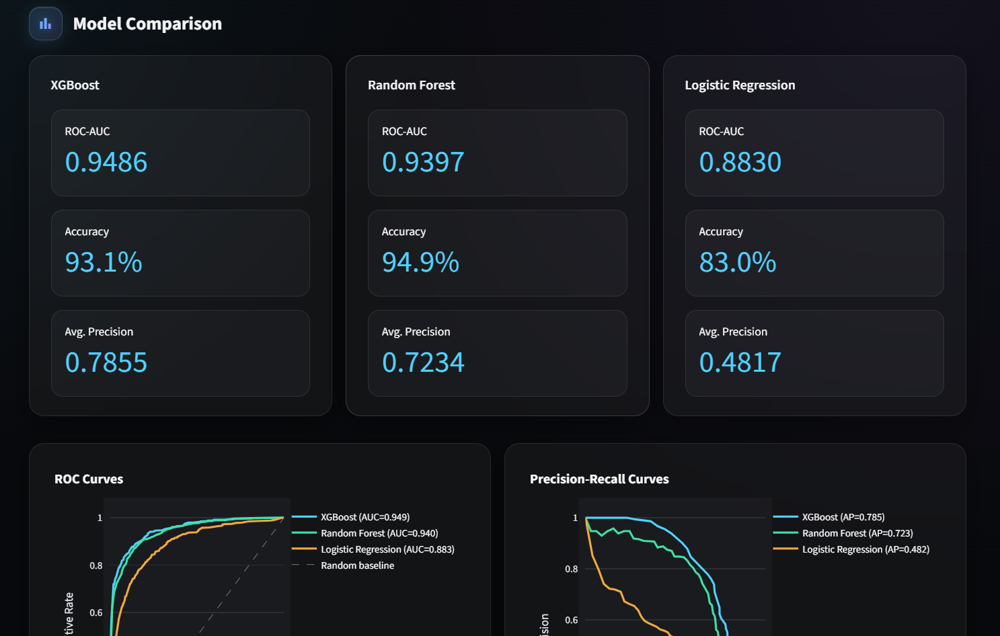

# Sepsis Risk Estimator

An interactive machine learning demo that estimates sepsis risk from a handful of patient vitals, built on the [PhysioNet/CinC 2019 Sepsis Challenge](https://physionet.org/content/challenge-2019/1.0.0/) dataset. Pick a model, enter what you know about a patient, and get a risk estimate with an AI-generated explanation of what it means.

**Live demo:** [sepsis-risk-demo.onrender.com](https://sepsis-risk-demo.onrender.com/)

> This is an educational project, not a medical device. Nothing here should inform real clinical decisions.

---

## What it does

The PhysioNet dataset gives you hourly ICU time-series for tens of thousands of patients — heart rate, temperature, lactate, dozens of other measurements, recorded (inconsistently) hour by hour. Realistically, nobody filling out a demo form is going to hand-type an entire ICU stay. So instead, this app asks for the 11 values a person would actually know off the top of their head — age, heart rate, temperature, that kind of thing — and fills in the rest by sampling from the real distribution of the training data. It runs that a bunch of times and averages the result, which turns out to be far more stable than trusting any single draw.

On top of that:

- **Three models to choose from** — XGBoost, Random Forest, and Logistic Regression, all trained on the same data, switchable at prediction time.
- **Accounts and history** — sign up, log in, and every prediction you make gets saved to MongoDB so you can look back at it later.
- **A model comparison page** — ROC curves, precision-recall curves, confusion matrices, and the full classification report for all three models, pulled straight from training-time evaluation.
- **An AI explains the result** — GPT-OSS-120B (via Groq) turns the raw percentage into a plain-English explanation and takes follow-up questions.
- **Hover explanations** — every input field has a small info icon explaining what it measures and why it's clinically relevant, so you're not just guessing what "MAP" means.

## Screenshots

Drop your screenshots into `assets/screenshots/` using the filenames below, and they'll show up here automatically.

| File | What to capture |
|---|---|
| `assets/screenshots/landing.png` | The landing page, with the login/sign-up card visible |
| `assets/screenshots/predict.png` | The Predict page with the model selector and patient input panel |
| `assets/screenshots/result.png` | A completed prediction — the gauge, risk band, and AI explanation chat |
| `assets/screenshots/history.png` | The History page with a few saved predictions and the risk-over-time chart |
| `assets/screenshots/models.png` | The About & Models page showing the ROC/PR curves |

```markdown





```

## Tech stack

- **Modelling:** XGBoost, scikit-learn (Random Forest, Logistic Regression)
- **App/UI:** Streamlit, Plotly
- **Auth:** bcrypt password hashing, session-based login
- **Database:** MongoDB Atlas
- **AI explanations:** Groq API (GPT-OSS-120B)
- **Hosting:** Render

## Project structure

```
sepsis_risk_app/
├── app.py                     # Landing page — hero section, login/sign-up
├── theme.py                   # Shared glassmorphic styling, icons, sidebar
├── auth_utils.py               # Sign-up / login / session handling
├── db_utils.py                  # MongoDB reads and writes
├── model_utils.py               # Model loading, feature assembly, inference
├── llm_utils.py                  # Groq API integration for explanations
├── pages/
│   ├── 1_Predict.py            # Main prediction workflow
│   ├── 2_History.py            # Past predictions, saved per user
│   └── 3_About.py              # Project info + model comparison dashboard
├── .streamlit/
│   └── config.toml             # Theme + sidebar nav settings
├── assets/
│   └── screenshots/            # README images (see above)
├── xgb_model.json               # XGBoost booster (native format)
├── xgb_preprocessor.joblib      # XGBoost's preprocessing pipeline
├── rf_pipeline.joblib            # Random Forest pipeline (preprocessing + model)
├── logreg_pipeline.joblib        # Logistic Regression pipeline
├── sepsis_meta.joblib             # Feature column order + metadata
├── feature_distributions.json     # Per-feature quantile grids for background sampling
├── model_evaluation.json          # ROC/PR curves, confusion matrices, metrics for all 3 models
├── llm_config.py                  # Local-only, gitignored — your Groq API key
├── db_config.py                   # Local-only, gitignored — your MongoDB URI
├── requirements.txt
└── render.yaml
```

The model files and `.json` artifacts are produced by the training notebook — see the `Model Training` section below if you're regenerating them from scratch.

## Running it locally

You'll need Python 3.13, a free [MongoDB Atlas](https://www.mongodb.com/cloud/atlas/register) cluster, and a [Groq API key](https://console.groq.com/). The app itself runs entirely on your machine, but MongoDB and Groq are cloud services, so you do need an internet connection for those two pieces — there's no way around that without swapping in a local database and a local LLM, which this project doesn't currently support.

**1. Clone the repo and set up a virtual environment**

```bash
git clone https://github.com/Neural-GPT/sepsis-risk-app.git
cd sepsis-risk-app
python -m venv venv
venv\Scripts\activate          # Windows
source venv/bin/activate       # macOS/Linux
```

**2. Install dependencies**

```bash
pip install -r requirements.txt
```

**3. Add your local config files**

These two files are gitignored on purpose — create them yourself in the project root:

`llm_config.py`
```python
GROQ_API_KEY = "gsk_your_actual_key_here"
```

`db_config.py`
```python
MONGO_URI = "mongodb+srv://<username>:<password>@<your-cluster>.mongodb.net/?appName=Cluster0"
```

**4. Make sure the model artifacts are in place**

`xgb_model.json`, `xgb_preprocessor.joblib`, `rf_pipeline.joblib`, `logreg_pipeline.joblib`, `sepsis_meta.joblib`, `feature_distributions.json`, and `model_evaluation.json` should all sit in the project root, next to `app.py`. If you don't have them, see `Model Training` below.

**5. Run it**

```bash
streamlit run app.py
```

It'll open at `http://localhost:8501`. Sign up for an account, and you're in.

## Model training

The models were trained in a Google Colab notebook, not in this repo — this app only handles inference. If you want to retrain:

1. Convert the PhysioNet time-series data into the engineered tabular format (per-patient mean/std/min/max/last-value/missing-rate across the 34 vitals and labs).
2. Train the three pipelines (XGBoost, Random Forest, Logistic Regression), each as a scikit-learn `Pipeline` with a `ColumnTransformer` preprocessing step.
3. Export XGBoost using its native format — `booster.save_model("xgb_model.json")` — rather than pickling it whole. XGBoost's pickle format isn't reliably portable across operating systems, and this bit us hard during development.
4. Export the Random Forest and Logistic Regression pipelines directly with `joblib.dump()`.
5. Export a combined `model_evaluation.json` with each model's accuracy, ROC-AUC, average precision, classification report, confusion matrix, and ROC/PR curve points, so the app can render the comparison dashboard without needing to reload or re-evaluate anything.

## Deployment

The live version runs on Render as a standard Python web service. `render.yaml` handles the build and start commands; `MONGO_URI` and `GROQ_API_KEY` are set as environment variables in Render's dashboard rather than committed anywhere.

## A note on the "randomization"

If you dig into `model_utils.py`, you'll notice most of the model's input features aren't things the user typed in — they're sampled from the training data's distribution. This is intentional and is how the app can produce a full prediction from just 11 known values instead of the ~200 features the model actually expects. It does mean a single prediction can vary slightly run to run, which is why the app averages across multiple draws and shows you the range, not just one number.

## License / disclaimer

Built for educational purposes on top of the PhysioNet/CinC 2019 Sepsis Challenge dataset. Not validated for clinical use, not a medical device, and not a substitute for an actual doctor.
